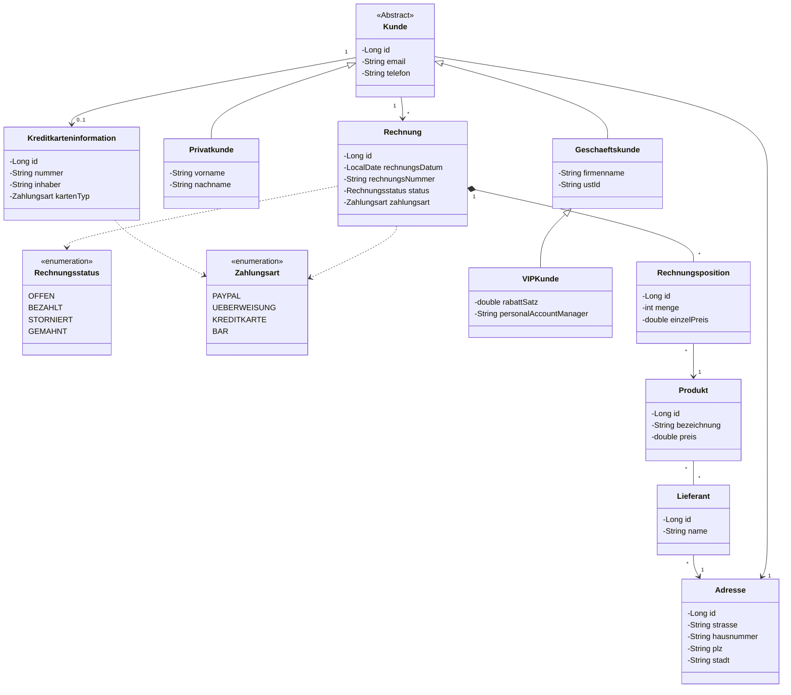

```mermaid
classDiagram

    %% Enums
    class Rechnungsstatus {
        <<enumeration>>
        OFFEN
        BEZAHLT
        STORNIERT
        GEMAHNT
    }

    class Zahlungsart {
        <<enumeration>>
        PAYPAL
        UEBERWEISUNG
        KREDITKARTE
        BAR
    }

    %% Entities
    class Adresse {
        -Long id
        -String strasse
        -String hausnummer
        -String plz
        -String stadt
    }

    class Kreditkarteninformation {
        -Long id
        -String nummer
        -String inhaber
        -Zahlungsart kartenTyp
    }

    class Kunde {
        <<Abstract>>
        -Long id
        -String email
        -String telefon
    }

    class Privatkunde {
        -String vorname
        -String nachname
    }

    class Geschaeftskunde {
        -String firmenname
        -String ustId
    }

    class VIPKunde {
        -double rabattSatz
        -String personalAccountManager
    }

    class Rechnung {
        -Long id
        -LocalDate rechnungsDatum
        -String rechnungsNummer
        -Rechnungsstatus status
        -Zahlungsart zahlungsart
    }

    class Rechnungsposition {
        -Long id
        -int menge
        -double einzelPreis
    }

    class Produkt {
        -Long id
        -String bezeichnung
        -double preis
    }

    class Lieferant {
        -Long id
        -String name
    }

    Kunde <|-- Privatkunde
    Kunde <|-- Geschaeftskunde
    Geschaeftskunde <|-- VIPKunde

    Kunde "1" --> "0..1" Kreditkarteninformation
    Kunde "*" --> "1" Adresse
    Lieferant "*" --> "1" Adresse
    Kunde "1" --> "*" Rechnung

    Rechnung "1" *-- "*" Rechnungsposition

    Rechnungsposition "*" --> "1" Produkt
    Produkt "*" -- "*" Lieferant

    Rechnung ..> Rechnungsstatus
    Rechnung ..> Zahlungsart
    Kreditkarteninformation ..> Zahlungsart
```
